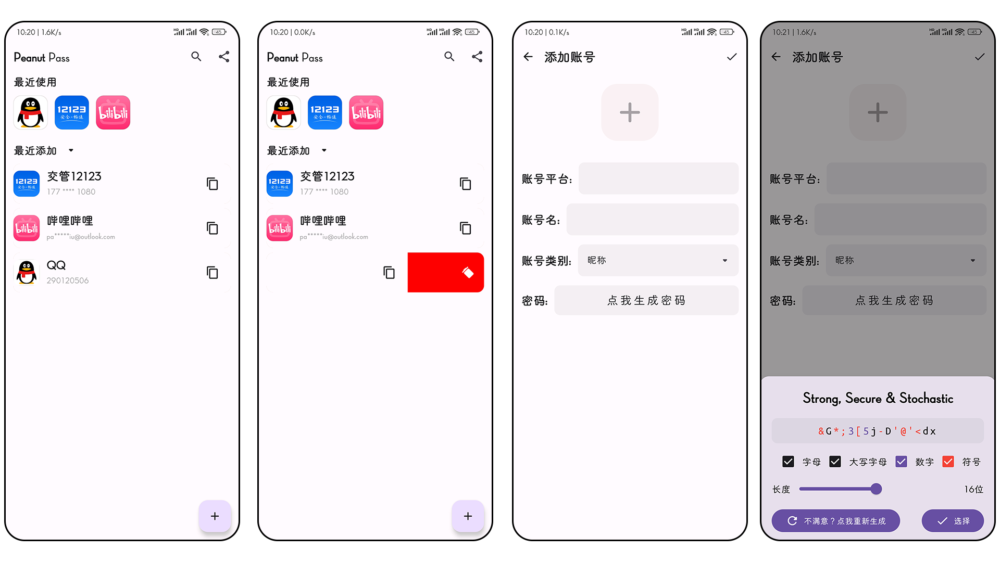

# PasswordManager
> 所有账户使用同一个密码会有极大的安全隐患，当某个网站必须要更改密码时新密码总是很难记住，是时候使用密码管理器来生成随机密码并统一管理了。同时，该App完全采用最先进的技术（如JetPack Compose、Dagger-Hilt等）进行开发，以便在最新的Android设备上获得更好的体验。

虽然App可能不是密码管理器的最佳选择，但是第一个学习Jetpack Compose与MVVM技术的App，同时也有这方面需求，属于是先开发再找需求，再者将密码交给三方管理远不如自己手里来的安全。

## 新技术与特性
- JetPack Compose
- MVVM
- JetPack DataStore
- Dagger-Hilt
- JetPack ROOM
- Material3

# 备份
点击备份按钮后，账号密码都是复制一份以明文放在`Download/Password Manager/`中

# todo
- [ ] 搜索图标
- [ ] 备份加密

# 参考链接
[1] [构建自动填充服务]( https://developer.android.com/identity/autofill/autofill-services?hl=zh-cn )

[2] [自动填充框架](https://developer.android.com/identity/autofill?hl=zh-cn)

[3] [Google代码参考](https://github.com/android/input-samples/blob/main/AutofillFramework/afservice/src/main/java/com/example/android/autofill/service/data/adapter/DatasetAdapter.java#L77)

[4] [显示生物识别省份验证对话框](https://developer.android.com/identity/sign-in/biometric-auth?hl=zh-cn#biometric-only)
